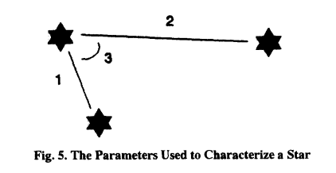

# My 0x20

## Astronomy, Astrophysics, Astrometry, Astrodynamics, AAAA

*142 points, 24 solves*
This social media app is back with a vengeance!

Active ADDVulcan players:

- WillC
- Bun
- n0tty
- schneider

# Challenge Description

This social media app is back with a vengeance!

### Ticket

Present this ticket when connecting to the challenge:

```
ticket{golf97715papa:___a bunch of unguessable stuff___}
```

Don't share your ticket with other teams.

### Connecting

Connect to the challenge on
```
myspace.satellitesabove.me:5016
```

Using netcat, you might run
```
nc myspace.satellitesabove.me 5016
```

### Files

You'll need these files to solve the challenge.

[Download Files](https://generated.2020.hackasat.com/myspace/myspace-golf97715papa.tar.bz2)

### Solving

Your team's flag for this challenge will look something like flag{golf97715papa:___a bunch of unguessable stuff___} .

# Writeup by schneider

## Initial solution

We connect to the server, provide our ticket and are presented with the following:
```
0.072431,	0.052706,	0.995980,	22.701675
-0.071974,	0.070047,	0.994944,	22.804413
-0.094412,	-0.121331,	0.988112,	22.196280
0.020262,	-0.072345,	0.997174,	12.009587
-0.095429,	-0.003886,	0.995429,	11.521773
-0.107534,	0.013113,	0.994115,	11.485020
0.149272,	0.032293,	0.988269,	10.912071
-0.059899,	0.121872,	0.990737,	10.957988
-0.103351,	0.007848,	0.994614,	11.071471
0.101520,	0.089827,	0.990770,	10.851761
0.014757,	-0.123807,	0.992197,	9.970439
0.041770,	-0.072088,	0.996523,	10.091747
0.130753,	0.021044,	0.991192,	9.752820
0.022727,	-0.159735,	0.986898,	9.960768

Index Guesses (Comma Delimited):

```

We poke the server a bit and enter `0,0,0`. The server replies with `More stars please, try again! (5 required)`.

This reminds us a lot about the `SpaceBook` challenge  where matching the magnitudes of the observations with
magnitudes from the catalog provided a solution. The current challenge does not allow this though. The
maximum magnitude of the observations is around 22, while the minimum magnitude in the supplied catalog
is about 50.

We start to focus on the angles of the observations instead. While solving `SpaceBook` we already
investigated alternative solutions which do not rely on matching magnitudes.

** Insert description n0tty's attempt here **

We ponder if the problem can be brute forced by simply taking a random set of 5 stars from the catalog,
computing the angles between them and then checking if these angles are a subset of the angles between each
of the observed stars. We do not follow up with this idea though.

Instead we start to dive again into existing literature to find a reasonably easy to implement solution.
One [paper](https://backend.orbit.dtu.dk/ws/portalfiles/portal/4159684/Liebe.pdf) proposes the following:

```
Pattern Recognition Of Star Constellations

A star catalogue is constructed so that there are 20
stars in the FOV on average. For all stars in the sky the
angular distance to the first and the second neighbour star is
registered. See Fig. 5. A star is then registered by:
1) the angular distance to the first neighbour star;
2) the angular distance to the second neighbour star; and
3) the spherical angle between the two neighbour stars.

Due to the uncertainty on the magnitude some stars
near the detection limit are only detected with a certain
possibility. Therefore, all possible star constellations are
included for all stars, see Fig. 6. Given a star image, the stars
are identified in the database. This typically results in a few
candidate positions for each star. However, the correct
candidates are easily found comparing the angular distances in
the star catalogue and the real image.
```


The idea is that given an observed star we will also observe the two stars closest (in terms of
angular distance) to it. We can then match the angles between them to the angles computed in
`1)`, `2)` and `3)` to find the observed star in the catalog.

First step is to build a database which contains the angles mentioned above from the provided
catalog ([test.txt](test.txt)). We chose to only calculate the first two
angles, print them to a file and later on edit them into a Python compatible array
([script](make_stardb.py) and [final database](stardb.py)).

The database now looks like this:
```Python
stars_next = (
(1951, 0.035250079289107186, 1875, 0.043189355150597519),
(1733, 0.026746487571716517, 2161, 0.032810810012101795),
[...]
)
```

Each entry corresponds to a star from the catalog. The first two numbers are the ID and angle of the star
closest (in terms of angle). The second two numbers are the ID and angle of the star second closest.

It is now trivial to write a function which matches the angles between an observed star and its two
closest neighbors to a star from the database. It essentially computes the combined angular distance
between the two angles and finds the star from the catalog with the smallest error. For good measure
and without further reasoning we chose a 2-norm as function to calculate the error:

```Python
def find_by_angles(a1, a2):
    min_dist = np.inf
    best = None
    for i in range(2500):
        d1 = a1 - stardb.stars_next[i][1]
        d2 = a2 - stardb.stars_next[i][3]
        dist = math.sqrt(d1*d1 + d2*d2)
        if dist < min_dist:
            best = i
            min_dist = dist
    return best
```

Next we write a small loop do calculate the required angles from the observed stars:
```Python
indexes = []
for i,rowt in ref_vectors.iterrows():
    star_obs = np.array([rowt['x'], rowt['y'], rowt['z']])

    # Find the closest two stars in the observation
    next_1_a = np.inf
    next_1_i = None
    next_2_a = np.inf
    next_2_i = None
    for i_t, rowt_t in ref_vectors.iterrows():
        if i == i_t:
            continue
        star_obs_t = np.array([rowt_t['x'], rowt_t['y'], rowt_t['z']])
        a = angle_between(star_obs, star_obs_t)
        if a < next_1_a:
            next_2_a = next_1_a
            next_2_i = next_1_i
            next_1_a = a
            next_1_i = i_t
        elif a < next_2_a:
            next_2_a = a
            next_2_i = i_t
    print("Two closest stars next to", i, "are :", next_1_i, next_1_a, next_2_i, next_2_a)
    index = stars.find_by_angles(next_1_a, next_2_a)
    print("Matched star:", index)
    indexes.append(index)
```

We run this against the first set of observations and end up with the following list of matched stars:
`181,205,288,574,734,927,1067,147,1223,1481,1523,1685,1831,1974`. We try the first 5
(`181,205,288,574,734`) and submit them to the server. It seems to be happy and answers with:
```
4 Left...
0.123631,	0.117222,	0.985380,	22.589828
-0.112944,	0.070455,	0.991100,	22.435747
0.152824,	-0.031004,	0.987767,	22.089382
0.033069,	-0.093182,	0.995100,	22.369328
0.009354,	0.045678,	0.998912,	11.448377
-0.077939,	-0.141525,	0.986862,	11.059937
0.093026,	-0.068048,	0.993336,	11.738625
-0.046303,	0.167243,	0.984828,	11.410283
0.089053,	-0.097312,	0.991262,	11.301759
-0.146949,	-0.057394,	0.987478,	11.074856
-0.024782,	0.006466,	0.999672,	10.559138
0.027100,	0.033507,	0.999071,	10.027180
0.153126,	0.057593,	0.986527,	9.706276
-0.139367,	-0.050330,	0.988961,	9.767477
-0.038998,	-0.027879,	0.998850,	8.877692
-0.146121,	-0.037434,	0.988558,	9.465178
-0.102519,	-0.125826,	0.986741,	8.224859

Index Guesses (Comma Delimited):
```

We are obviously onto something and start to automate processing the data. Submitting the full result
(`181,205,288,574,734,927,1067,147,1223,1481,1523,1685,1831,1974`) during the first round also works.
The result for the second round ('149,288,2230,415,574,147,623,288,898,1131,1523,1685,128,1970,1974,2042,15`)
is rejected though:
```
Tried to use duplicates huh....
Index Guesses (Comma Delimited):
```

We check our list and discover that we indeed to have a duplicate in there (288). Our fix is to
deduplicate the list using `set(indexes)`.

The resulting list of `288,128,898,1131,623,15,1970,147,1523,149,2230,1685,1974,2042,574,415`
does not work either though:
```
Too many were incorrect, try again
Index Guesses (Comma Delimited):
```

It becomes obvious that our solution is not accurate enough and produces too many incorrect results.
As we really only need 5 correct guesses, we start to only send the first 5 results
(`list(set(indexes))[:5]`). The resulting list (`149,288,2230,415,574`) is not not accepted either:

```
Not enough were correct, try again
Index Guesses (Comma Delimited):
```

This leads to our next quick fix: Take a random subset of size 10 from the results and submit it to
the server. Our assumption is that we will eventually find an accepted subset:
```Python
indexes = np.array([str(i) for i in set(indexes)])
chosen_idx = np.random.choice(len(indexes), replace=False, size=10)
```

After multiple tries we eventually find a solution for the second round
(`415,15,1131,1523,1974,574,1685,2042,288,898`). We hard code the results for the first two rounds
and try again. Luckily this time the guesses for all remaining rounds are accepted and we receive our flag:
```
1011,559,422,483,1932,2288,288,411,2479,1172
0 Left...
flag{golf97715papa:GHjv_TES4lSzgJBbQdhRTwe7uQA4Ayxt-0HLbLh8Xh-9YizNKyuqq26qP-DyFMlI7ypbfpdb-_SH2LWyqvW0k7E}
```

The complete script which implements this solution can be found in [myspace.py](myspace.py).

## Improved solution
The fact that our solution needs deduplication and picking a random subset to produce accepted answers
lead us to come back and investigate the cause.

### Also using the angle between the two closest neighbor stars
Our original solution only implements the first two measurements (angle between the star and its two
closest neighbors). It does not implement the third measurement: The angle between the two neighbor
stars themselves. The solution which can be found in [myspace_improved.py](myspace_improved.py) adds
this measurement. Sadly simply adding this does not remove the need to picking a random subset from
the computed list of stars. This solution also speeds up generating the database.

### Only taking the 5 best matches
Our original solution does not take into account how large the angular error between the observed angles
and the angles from the database is. It simply always produces a result no matter how large the error.
This can lead to wrong classifications (imagine a star close to the the edge of the image sensor, it might
not have its closest two neighbors from the star catalog visible anymore). Manually looking at the
values of the angular error shows that good matches have errors below 2e-6 while bad matches usually
have errors larger 1e-3.

As we know that we only need to supply 5 matching stars, the simplest solution is to supply the 5 best
matching stars. This is implemented in [myspace_improved.py](myspace_improved.py) and is a
stable solution for this challenge.

Using a bit of numpy also cleans up the code significantly:

```Python
for i, obs_position in enumerate(obs_positions):
        # Calculate the angles between this observation and all other observations.
        # Find the two obervations which have the smallest angle.
        angels = [angle_between(obs_position, other_obs_pos) for other_obs_pos in obs_positions]
        closest_obs = np.argsort(angels)[:3]

        # Get the angles as well as the angle between the two closest observations.
        a1 = angels[closest_obs[1]]
        a2 = angels[closest_obs[2]]
        ab = angle_between(obs_positions[closest_obs[1]], obs_positions[closest_obs[2]])

        print(f"Two closest observations next to observation {i} are {closest_obs[1]} and {closest_obs[2]}")
        index, error = stars_improved.find_by_angles(a1, a2, ab)
        print(f"Matched star from catalog: {index} (Error: {error:.6})")
        matches.append((index, error))
```

During this investigation we also realize that the challenge accepts at most 1 wrong index inside the
provided list of stars.
