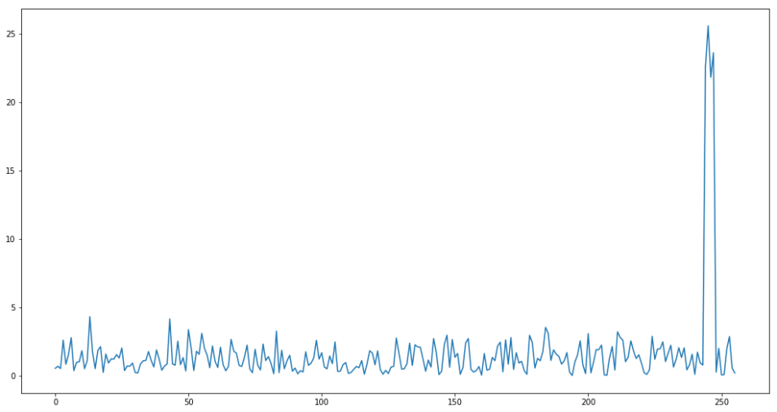

# Leaky Crypto
## Payload Modules

*205 points, 13 solves*

My crypto algorithm runs in constant time, so I'm safe from sidechannel leaks, right?

Active ADDVulcan players:

- Lennert 
- n0tty

# Challenge Description

My crypto algorithm runs in constant time, so I'm safe from sidechannel leaks, right?

Note: To clarify, the sample data is plaintext inputs, NOT ciphertext

### Files
You'll need these files to solve the challenge.

* [test.txt](./test.txt)
* [readme.txt](./readme.txt)


### Solving
Your team's flag for this challenge will look something like flag{uniform54349juliet:___a bunch of unguessable stuff___}


### Contents of readme.txt
```
Hello, fellow space enthusiasts!

I have been tracking a specific satellite and managed to intercept an interesting 
piece of data. Unfortunately, the data is encrypted using an AES-128 key with ECB-Mode.

Encrypted Data: 7972c157dad7b858596ecdb798877cc4ed4b03d6822295954e69b7ecebb704af08c054a03a374f8bdaa18ff16ba09be2b6b25f1ef73ef80111646de84cd3af2514501e056889e95c680f7d199b6531e9dd6ee599aeb23835327e6e853a9a40a9f405bd1443e014363ea46631582b97c3d3f83f4e1101da2557f9b03808a61968

Using proprietary documentation, I have learned that the process of generating the 
AES key always produces the same first 6 bytes, while the remaining bytes are random:

Key Bytes 0..5: 97ca6080f575

The communication protocol hashes every message into a 128bit digest, which is encrypted
with the satellite key, and sent back as an authenticated ACK. This process fortunately 
happens BEFORE the satellite attempts to decrypt and process my message, which it will
immediately drop my message as I cannot encrypt it properly without the key.

I have read about "side channel attacks" on crypto but don't really understand them, 
so I'm reaching out to you for help. I know timing data could be important so I've 
already used this vulnerability to collect a large data set of encryption times for 
various hash values. Please take a look!
```

# Writeup by Lennert
The provided [readme.txt](./readme.txt) contains some interesting information. We know that the flag is encrypted using the Advanced Encryption Standard (AES) with a 16-byte key, employed in the Electronic Code Book (ECB) mode of operation. As the key is not generated randomly we receive the first six bytes of key material as part of the challenge description.

Additionally, we are provided with a list of plaintexts and the time it took to compute the resulting ciphertext. The challenge description hints at the fact that we should exploit the timing information to conduct a side-channel attack. Since the challenge only provided plaintext and time pairs it had to be some kind of timing attack. Googling for AES timing side channel attack quickly leads you to cache timing side channel attacks.


## Literature
The first paper seemingly related to this challenge is the 2005 paper by Bernstein titled [Cache-timing attacks on AES](https://cr.yp.to/antiforgery/cachetiming-20050414.pdf). In this paper the author targets an AES T-tables implementation and exploits the timing variation introduced by the CPU's cache memory. The main reasoning for the attack described in this paper is that the time required to perform a table lookup will depend on the index. Specifically, Bernstein speculates that the table lookup T0[PT[0] ⊕ K[0]] will leak information about the the index (PT[0] ⊕ K[0]) through a timing side-channel.

The first six key bytes (provided in the [readme.txt](./readme.txt)) allow us to verify our hypothesis on how the implementation leaks exactly. I initially implemented the attack described above but was unable to use this method to recover the known key bytes. Additionally, there was no obvious pattern in the provided data which suggested that the information provided from one table lookup could be used to recover any of the other key bytes.

Searching for Cache-timing attacks on AES on Google or Google Scholar would eventually lead you to the paper titled [Cache-collision timing attack against AES](http://www.jbonneau.com/doc/BM06-CHES-aes_cache_timing.pdf) (CHES 2006) by Bonneau and Mironov. Or alternatively you could also find a [Youtube video](https://www.youtube.com/watch?v=_06jRYrgUFU) which explains the same idea.

As the title suggests, this cache-timing side-channel attack relies on a collision. Specifically, the main idea is that there will be an observable timing difference when processing T0[PT[0] ⊕ K[0]] and T0[PT[4] ⊕ K[4]] if a collision (PT[0] ⊕ K[0] == PT[4] ⊕ K[4]) occurs.

## How it works

### AES Background

Describing all of the inner workings of the AES is beyond the scope of this writeup, but plenty of resources are available online. A short introduction to AES is provided for completeness, see the following links for more details:
https://en.wikipedia.org/wiki/Advanced_Encryption_Standard
https://www.youtube.com/watch?v=O4xNJsjtN6E 
https://www.esat.kuleuven.be/cosic/blog/co6gc-aes/

AES performs a number of operations on a 16-byte input data using a 16-byte key (for AES-128). A simple pseudo-implementation could look something like this:

```C
encrypt(uint8_t plaintext[16], uint8_t key[16], uint8_t ciphertext[16])
{
    uint8_t state[16];

    //Initial AddRoundKey
    for (int i = 0; i < 16; i++){
        state[i] = plaintext[i] ^ key[i];
    }
    
    //AES Rounds
    for (int round = 1; round <= 10; round++){
        
        //Subbytes
        for (int i = 0; i < 16; i++){
            state[i] = sbox[state[i]];
        }
        
        ShiftRows(state);
        if (round != 10) { //Final round has no mix-columns
            MixColumns(state);
        }
        AddRoundKey(state, round);
    }
    
    //Copy to output AddRoundKey
    for (int i = 0; i < 16; i++){
        ciphertext[i] = state[i];
    }
}
```

This classic implementation involves single-byte operations, which will not be an efficient use of 32-bit controllers. Thus a more common implementation is one that uses "T-Tables" where the target microcontroller is a 32-bit (or higher) architecture. The T-Table description is present in the original AES description.

### T-Table Implementation

T-Tables allow us to effectively run an entire round of AES as a series of lookups. Taking an example from [MBED-TLS, you can see a macro called AES_FROUND](https://github.com/newaetech/chipwhisperer/blob/develop/hardware/victims/firmware/crypto/mbedtls/library/aes.c#L670) that implements a round of AES, replacing effectively all the operations inside the loop:

```C
#define AES_FROUND(X0,X1,X2,X3,Y0,Y1,Y2,Y3)     \
{                                               \
    X0 = *RK++ ^ FT0[ ( Y0       ) & 0xFF ] ^   \
                 FT1[ ( Y1 >>  8 ) & 0xFF ] ^   \
                 FT2[ ( Y2 >> 16 ) & 0xFF ] ^   \
                 FT3[ ( Y3 >> 24 ) & 0xFF ];    \
                                                \
    X1 = *RK++ ^ FT0[ ( Y1       ) & 0xFF ] ^   \
                 FT1[ ( Y2 >>  8 ) & 0xFF ] ^   \
                 FT2[ ( Y3 >> 16 ) & 0xFF ] ^   \
                 FT3[ ( Y0 >> 24 ) & 0xFF ];    \
                                                \
    X2 = *RK++ ^ FT0[ ( Y2       ) & 0xFF ] ^   \
                 FT1[ ( Y3 >>  8 ) & 0xFF ] ^   \
                 FT2[ ( Y0 >> 16 ) & 0xFF ] ^   \
                 FT3[ ( Y1 >> 24 ) & 0xFF ];    \
                                                \
    X3 = *RK++ ^ FT0[ ( Y3       ) & 0xFF ] ^   \
                 FT1[ ( Y0 >>  8 ) & 0xFF ] ^   \
                 FT2[ ( Y1 >> 16 ) & 0xFF ] ^   \
                 FT3[ ( Y2 >> 24 ) & 0xFF ];    \
}
```

Each of these tables is used for one column of the AES state. Note above how `FT0` is always used for the first column for example. In the previous code block, `FT` stands for `Forward T-Table`. The possible inputs to each table is shown below:

| FT0    | FT1    | FT2    | FT3   |
|-------------|-------------|-------------|-------------|
|PT[0] ⊕ K[0]|PT[1] ⊕ K[1]|PT[2] ⊕ K[2]|PT[3] ⊕ K[3]|
|PT[4] ⊕ K[4]|PT[5] ⊕ K[5]|PT[6] ⊕ K[6]|PT[7] ⊕ K[7]|
|PT[8] ⊕ K[8]|PT[9] ⊕ K[9]|PT[10] ⊕ K[10]|PT[11] ⊕ K[11]|
|PT[12] ⊕ K[12]|PT[13] ⊕ K[13]|PT[14] ⊕ K[14]|PT[15] ⊕ K[15]|


### Cached T-Table & Timing Dependancy

The basic idea behind the attack is that when the table lookup FT0[ PT[0] ⊕ K[0] ] is performed, part of the table FT0 will be loaded into the cache. Afterwards, when we perform FT0[ PT[4] ⊕ K[4] ] we might observe a cache hit if PT[4] ⊕ K[4] is the same as (or close to) PT[0] ⊕ K[0]. If PT[4] ⊕ K[4] is not equal to PT[0] ⊕ K[0] it will take longer to perform the table lookup. In other words, if there is a collision between PT[0] ⊕ K[0] and PT[4] ⊕ K[4] the table lookup will be faster resulting in timing side-channel leakage.

### T-Table Pseudocode

If helpful to better understand the T-Table implementation, the following pseduo-code is created to show the implementation for the first round only. By inserting into the previous code a new variable called `INPUT`, where INPUT[N] = PT[N] ⊕ K[N] we have the following:

```C
    X0 = *RK++ ^ FT0[ ( INPUT[0] ) ] ^   \
                 FT1[ ( INPUT[5] ) ] ^   \
                 FT2[ ( INPUT[10]) ] ^   \
                 FT3[ ( INPUT[15]) ];    \
                                                \
    X1 = *RK++ ^ FT0[ ( INPUT[4] ) ] ^   \
                 FT1[ ( INPUT[9] ) ] ^   \
                 FT2[ ( INPUT[14]) ] ^   \
                 FT3[ ( INPUT[3] ) ];    \
                                                \
    X2 = *RK++ ^ FT0[ ( INPUT[8] ) ] ^   \
                 FT1[ ( INPUT[13]) ] ^   \
                 FT2[ ( INPUT[2] ) ] ^   \
                 FT3[ ( INPUT[7] ) ];    \
                                                \
    X3 = *RK++ ^ FT0[ ( INPUT[12]) ] ^   \
                 FT1[ ( INPUT[1] ) ] ^   \
                 FT2[ ( INPUT[6] ) ] ^   \
                 FT3[ ( INPUT[11]) ];    \
```

The following shows the order of access to PT & Key bytes for each table:

```
X0: FT0{ 0} ^ FT1{ 5} ^ FT2{10} ^ FT3{15}
X1: FT0{ 4} ^ FT1{ 9} ^ FT2{14} ^ FT3{ 3}
X2: FT0{ 8} ^ FT1{13} ^ FT2{ 2} ^ FT3{ 7}
X3: FT0{12} ^ FT1{ 1} ^ FT2{ 6} ^ FT3{11}
```

Note reading down each column matches the table above, but some of the columns are in different orders. This ordering will make an additional leakage apparent (but not explained).

## Exploiting the timing leakage
As part of the challenge description we received the first 6 bytes of the key. We can use the known value for key byte 0 to try and recover key byte 4 and verify that it matches with the provided value for key byte 4.

For each of the provided measurements we can compute the correct value of PT[0] ⊕ K[0]. We calculate PT[4] ⊕ K[4] for all of the 256 possible values of K[4]. For each of the key guesses we can average the timing measurements for which the value of PT[0] ⊕ K[0] is equal to PT[4] ⊕ K[4], as well as average the time for all other measurements. For a few of the key guesses we expect to see a bigger difference between both of these averages, these will be our candidates for key byte 4. 

The following plot shows the difference of means (y-axis) vs the value of the key guess (x-axis). 


The top 4 candidates for this key byte are 0xF5, 0xF7, 0xF4 and 0xF6. This list of candidates contains the known value for key byte 4 (0xF5), a good indicator that we are on the right track to solve this challenge!

Similarly we can retrieve candidates for most of the other key bytes:
|Key byte|candidates|
|--------|----------|
|0|0x97|
|1|0xCA|
|2|0x60|
|3|0x80|
|4|0xF5|
|5|0x75|
|6|0xE6, 0xE4, 0xE5, 0xE7|
|7|0x46, 0x47, 0x44, 0x45|
|8|0xE4, 0xE7, 0xE6, 0xE5|
|9|0x54, 0x57, 0x55, 0x56|
|10|0xF4, 0xF5, 0xF7, 0xF6|
|11||
|12|0xBC, 0xBE, 0xBD, 0xBF|
|13|0x15, 0x17, 0x16, 0x14|
|14|0x68, 0x69, 0x6B, 0x6A|
|15|0x5E, 0x5C, 0x5D, 0x5F|

Collisions were run across all possible bytes as well, not just those that would be expected based on `FTn` tables. Implementations of T-Tables will vary, including use of a single T-Table for example.

For example using byte 5 resulted in useful candidates for byte 12, which is not expected as byte 5 uses `FT1` and byte 12 uses `FT0`. Visually it can be seen from the previous code listing that a pattern appears for the generation of X0 leaking information about X3: Byte 5 leaks Byte 12, Byte 10 leaks byte 1, and Byte 15 leaks byte 6.

## Brute Forcing

At this point the remaining key space could be brute forced using a known plaintext/ciphertext pair which was provided as part of the challenge in the form of the encrypted flag and the flag structure.

This is done using a number of partial candidate arrays (defined above), where the one fully unknown array `_11` is just all possibilities (`range(0,256)`).

```Python
for i in itertools.product(_6,_7,_8,_9,_10,_11,_12,_13,_14,_15):
    key = aes_key_prefix + bytearray(i)
    cipher = AES.new(key, AES.MODE_ECB)
    pt = cipher.decrypt(ct_bf)
    if pt == b'flag{uniform5434':
        print('Key recovered:', key.hex())
        break
```

The recovered key was `97ca6080f575e646e557f755bf15685e` and the resulting decrypted flag was `flag{uniform54349juliet:GL2aGs7ys8ygcW0kFBPLbwEdjLbwNltiPdX_ANqtOFbUpEh_ciY8tWZd4y2VblkUhOl-PxXJdJYK86pIHmmwcw0}`

## Full Attack

For more details on how these key bytes were recovered and the full implementation you can look at the provided Python [notebook](./leaky-crypto.ipynb). You should be able to use a GITHub preview in the previous link, or run this in [Google CoLab](https://colab.research.google.com) if you would like to see this work in real life without installing Jupyter.