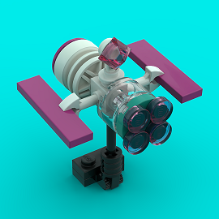

# ADDVulcan 
## **Hack-A-Sat 2020** 

<!-- ALL-CONTRIBUTORS-BADGE:START - Do not remove or modify this section -->

<!-- ALL-CONTRIBUTORS-BADGE:END -->
[**Hack-A-Sat Challenges**](https://www.hackasat.com/)

### [Astronomy, Astrophysics, Astrometry, Astrodynamics, AAAA](https://github.com/ADDVulcan/ADDVulcan/tree/master/Astronomy%20Astrophysics%20Astrometry%20Astrodynamics%20AAAA)

- [Seeing Stars](https://github.com/ADDVulcan/ADDVulcan/tree/master/Astronomy%20Astrophysics%20Astrometry%20Astrodynamics%20AAAA/Seeing%20Stars)
- [My 0x20](https://github.com/ADDVulcan/ADDVulcan/tree/master/Astronomy%20Astrophysics%20Astrometry%20Astrodynamics%20AAAA/My%200x20)

### [Communication Systems](https://github.com/ADDVulcan/ADDVulcan/tree/master/Communication%20Systems)

- [Phasors to Kill](https://github.com/ADDVulcan/ADDVulcan/tree/master/Communication%20Systems/Phasors%20to%20Kill)

### [Payload Modules](https://github.com/ADDVulcan/ADDVulcan/tree/master/Payload%20Modules)

- [SpaceDB](https://github.com/ADDVulcan/ADDVulcan/tree/master/Payload%20Modules/SpaceDB)
- [Leaky Crypto](https://github.com/ADDVulcan/ADDVulcan/tree/master/Payload%20Modules/Leaky%20Crypto)

### ADDVulcan Virtual Machine for Satellite Hacking
Using [Virtual Box](https://www.virtualbox.org/wiki/Downloads) you can download our VM set up with helpful tools to get you started. Download the OVA VM Image and import into VirtualBox [ADDVulcan-Hack-A-Sat](https://drive.google.com/drive/folders/1LWPzghHtamR5CsnOS6ASfr3qKz8giw2T?usp=sharing)

## Contributors ✨

Thanks goes to these wonderful people:

<!-- ALL-CONTRIBUTORS-LIST:START - Do not remove or modify this section -->
<!-- prettier-ignore-start -->
<!-- markdownlint-disable -->
<table>
  <tr>
    <td align="center"><a href="https://github.com/will-caruana"> <b>will-caruana</b></a> <a href="#eventOrganizing-will-caruana" title="Event Organizing">📋</a></td>
    <td align="center"><a href="https://homes.cs.washington.edu/~supersat/"> <b>Karl Koscher</b></a> <a href="https://github.com/ADDVulcan/ADDVulcan/commits?author=supersat" title="Code">💻</a></td>
    <td align="center"><a href="https://www.amiedd.com"> <b>Amie DD</b></a> <a href="https://github.com/ADDVulcan/ADDVulcan/commits?author=AmieDD" title="Code">💻</a></td>
    <td align="center"><a href="http://1bitsquared.com"> <b>Piotr Esden-Tempski</b></a> <a href="https://github.com/ADDVulcan/ADDVulcan/commits?author=esden" title="Code">💻</a></td>
    <td align="center"><a href="http://alvarop.com"> <b>Alvaro</b></a> <a href="https://github.com/ADDVulcan/ADDVulcan/commits?author=alvarop" title="Code">💻</a></td>
    <td align="center"><a href="https://twitter.com/shipcod3"> <b>Jay Turla</b></a> <a href="https://github.com/ADDVulcan/ADDVulcan/commits?author=shipcod3" title="Code">💻</a></td>
    <td align="center"><a href="https://github.com/schneider42"> <b>schneider42</b></a> <a href="https://github.com/ADDVulcan/ADDVulcan/commits?author=schneider42" title="Code">💻</a></td>
  </tr>
  <tr>
    <td align="center"><a href="https://github.com/zjpahle"> <b>zjpahle</b></a> <a href="https://github.com/ADDVulcan/ADDVulcan/commits?author=zjpahle" title="Code">💻</a></td>
    <td align="center"><a href="https://github.com/shannonfritz"> <b>Shannon Fritz</b></a> <a href="https://github.com/ADDVulcan/ADDVulcan/commits?author=shannonfritz" title="Code">💻</a></td>
    <td align="center"><a href="https://assortedhackery.com"> <b>Mike Walters</b></a> <a href="https://github.com/ADDVulcan/ADDVulcan/commits?author=miek" title="Code">💻</a></td>
    <td align="center"><a href="https://github.com/n0tty"> <b>Tanoy Bose</b></a> <a href="https://github.com/ADDVulcan/ADDVulcan/commits?author=n0tty" title="Code">💻</a></td>
    <td align="center"><a href="https://twitter.com/ninjabunny9000"> <b>Bun</b></a> <a href="https://github.com/ADDVulcan/ADDVulcan/commits?author=NinjaBunny9000" title="Code">💻</a></td>
    <td align="center"><a href="https://ethicalhackers.club"> <b>Ameer Pornillos</b></a> <a href="https://github.com/ADDVulcan/ADDVulcan/commits?author=ameerpornillos" title="Code">💻</a></td>
    <td align="center"><a href="https://github.com/cameronbosnic"> <b>cameronbosnic</b></a> <a href="https://github.com/ADDVulcan/ADDVulcan/commits?author=cameronbosnic" title="Code">💻</a></td>
  </tr>
  <tr>
    <td align="center"><a href="https://github.com/5hu5ky"> <b>5hu5ky</b></a> <a href="https://github.com/ADDVulcan/ADDVulcan/commits?author=5hu5ky" title="Code">💻</a></td>
    <td align="center"><a href="https://github.com/rootkow"> <b>Matt</b></a> <a href="https://github.com/ADDVulcan/ADDVulcan/commits?author=rootkow" title="Code">💻</a></td>
    <td align="center"><a href="https://github.com/Riboflavaflav"> <b>Riboflavaflav</b></a> <a href="https://github.com/ADDVulcan/ADDVulcan/commits?author=Riboflavaflav" title="Code">💻</a></td>
    <td align="center"><a href="https://github.com/kandi3kan3"> <b>Jonathan Zentgraf</b></a> <a href="https://github.com/ADDVulcan/ADDVulcan/commits?author=kandi3kan3" title="Code">💻</a></td>
    <td align="center"><a href="https://github.com/murrayma"> <b>Martin Murray</b></a> <a href="https://github.com/ADDVulcan/ADDVulcan/commits?author=murrayma" title="Code">💻</a></td>
    <td align="center"><a href="http://www.sharebrained.com/"> <b>Jared Boone</b></a> <a href="https://github.com/ADDVulcan/ADDVulcan/commits?author=jboone" title="Code">💻</a></td>
    <td align="center"><a href="https://github.com/LennertW"> <b>LennertW</b></a> <a href="https://github.com/ADDVulcan/ADDVulcan/commits?author=LennertW" title="Code">💻</a></td>
  </tr>
  <tr>
    <td align="center"><a href="https://github.com/McCryptoFace"> <b>Crypty McCryptoFace</b></a> <a href="https://github.com/ADDVulcan/ADDVulcan/commits?author=McCryptoFace" title="Code">💻</a></td>
    <td align="center"><a href="https://github.com/accelocomodator"> <b>accelocomodator</b></a> <a href="https://github.com/ADDVulcan/ADDVulcan/commits?author=accelocomodator" title="Code">💻</a></td>
    <td align="center"><a href="https://gitlab.com/0xdec"> <b>Jordi Pakey-Rodriguez</b></a> <a href="https://github.com/ADDVulcan/ADDVulcan/commits?author=0xdec" title="Code">💻</a></td>
    <td align="center"><a href="http://greatscottgadgets.com/"> <b>Michael Ossmann</b></a> <a href="https://github.com/ADDVulcan/ADDVulcan/commits?author=mossmann" title="Code">💻</a></td>
    <td align="center"><a href="http://straithe.com"> <b>Straithe</b></a> <a href="https://github.com/ADDVulcan/ADDVulcan/commits?author=straithe" title="Code">💻</a></td>
    <td align="center"><a href="http://blogmal.42.org"> <b>Sec</b></a> <a href="https://github.com/ADDVulcan/ADDVulcan/commits?author=Sec42" title="Code">💻</a></td>
    <td align="center"><a href="https://github.com/gregdavill"> <b>Gregory Davill</b></a> <a href="https://github.com/ADDVulcan/ADDVulcan/commits?author=gregdavill" title="Code">💻</a></td>
  </tr>
  <tr>
    <td align="center"><a href="https://github.com/neubauek"> <b>neubauek</b></a> <a href="https://github.com/ADDVulcan/ADDVulcan/commits?author=neubauek" title="Code">💻</a></td>
    <td align="center"><a href="https://github.com/Rotbot9k"> <b>Clayton </b></a> <a href="https://github.com/ADDVulcan/ADDVulcan/commits?author=Rotbot9k" title="Code">💻</a></td>
    <td align="center"><a href="http://destevez.net"> <b>Daniel Estévez</b></a> <a href="https://github.com/ADDVulcan/ADDVulcan/commits?author=daniestevez" title="Code">💻</a></td>
    <td align="center"><a href="https://dominicspill.com"> <b>Dominic Spill</b></a> <a href="https://github.com/ADDVulcan/ADDVulcan/commits?author=dominicgs" title="Code">💻</a></td>
    <td align="center"><a href="https://www.x1sys.com"> <b>negative_alpha</b></a> <a href="https://github.com/ADDVulcan/ADDVulcan/commits?author=negative-alpha" title="Code">💻</a></td>
    <td align="center"><a href="https://github.com/Jigokuniku"> <b>Jon Steinberg</b></a> <a href="https://github.com/ADDVulcan/ADDVulcan/commits?author=Jigokuniku" title="Code">💻</a></td>
    <td align="center"><a href="http://www.oflynn.com"> <b>Colin O'Flynn</b></a> <a href="https://github.com/ADDVulcan/ADDVulcan/commits?author=colinoflynn" title="Code">💻</a></td>
  </tr>
</table>

<!-- markdownlint-enable -->
<!-- prettier-ignore-end -->
<!-- ALL-CONTRIBUTORS-LIST:END -->

This project follows the [all-contributors](https://github.com/all-contributors/all-contributors) specification. Contributions of any kind welcome!
